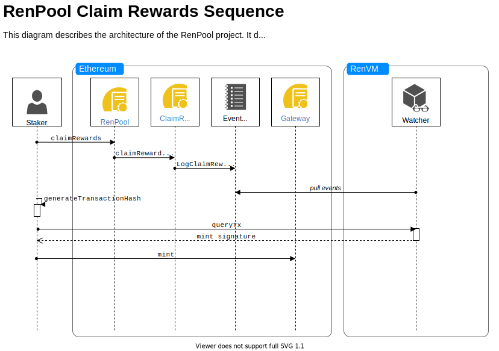

# RenPool Project

## Bringing community pools to the REN ecosystem

### What is REN?

RenVM is a permissionless and decentralized virtual machine protocol.

> _A secure network of virtual computers that power interoperability for decentralized applications, enabling cross-chain lending, exchanges, collateralization & more._

This document assumes a high-level understanding of the RenVM protocol.
Check <https://github.com/renproject/ren/wiki/> to learn more about the inner workings of RenVM.
More information about Ren and the Ren project can be found in <https://renproject.io/renvm>.
Visit <https://github.com/renproject> to explore their repos.

In other words, RenVM is a network of nodes, called _darknodes_, that perform Secure Multiparty Computation (SMPC) over Shamir Secret Shares, to control ECDSA Private Keys securely, and hence custody funds for cross-chain bridging.

These _darknodes_ earn fees for every transaction they process.
In order to power a _darknode_, you need to stake a utility token provided by RenVM.
This is the **REN** token, an [`ERC20` Ethereum token](https://ethereum.org/en/developers/docs/standards/tokens/erc-20/).
The amount you have to stake, known as _bond_, is `100,000 REN` (currently about `88,000 USD`).

### What is the RenPool?

The RenPool project allows users to participate in **REN** staking pools,
which are rewarded with a share of fees earned by the _Darknode_.

> **You can earn _Darknode_ rewards without having 100K REN nor operaing a _Darknode_**

### RenPool Features

RenPool allows any user to

- create a new pool by becoming the node operator of a new _Darknode_.
- deposit **REN**s into a pool and when it reaches 100K, the RenPool team will set up and manage a new _Darknode_.
- **[TODO]** request a withdraw of a running pool. When another staker wants to take your place, they transfer the staked **REN**s to you, and they become part of the pool. However, keep in mind that you will lose your rewards for that epoch. Instead the new staker will receive it.
- **[TODO]** automatically deregister a running node when more than 50% of the staked REN collectively requests to withdraw their share.

Moreover, the RenPool team will **never** be in possession of your **REN** tokens nor your rewards.

### **TODO**

- We need to audit the smart contracts
- What about slashing?
- Ethereum gas?
- Explain fees for owner and node operator and staker

### How RenPool works

At its core, RenPool is powered by smart contracts that dictates how the pool rewards are distributed among its users.


There are three main actors when using a RenPool.

- Owner
- Node Operator
- Stakers

In turn, the RenPool uses Ren smart contracts
<https://renproject.github.io/ren-client-docs/contracts/>
to interact with the RenVM in a decentralized and permissionless manner.
Ren contract addresses are published

- for `mainnet`. <https://renproject.github.io/contracts-ts/#/mainnet>
- for `testnet`. <https://renproject.github.io/contracts-ts/#/testnet>

### RenPool states

The following picture shows different states the RenPool can be in.


When _unlocked_, stakers can either `deposit` or `withdraw` **REN** tokens as they see fit.
However, when the pool collects the Ren Bond, currently 100K **REN** tokens, it becomes _locked_.
Once the pool is _locked_, the node operator can register a new darknode
<https://docs.renproject.io/darknodes/getting-started/digital-ocean-or-how-to-setup-a-darknode/mac-os-and-linux>.

> ***Please note that the REN tokens collected by the contract are never in possession of the node operator nor the owner.***

After the darknode has been registered,
it will start to earn fees.
The stakers can then withdraw their respective percentage of these fees.

### Claiming Rewards



## Getting started

The RenPool project uses the _Yarn_ package manager and the _Hardhat_ [https://hardhat.org/getting-started/](https://hardhat.org/getting-started/) development environment for Ethereum.
We use [Alchemy](https://www.alchemy.com/) JSON-RPC provider to fork Ethereum networks.

You can skip to the next section if you have a working _Yarn_ installation.
If not, here is how to install it.

```sh
npm install -g yarn
```

### Install project

```sh
yarn install
```

### Create an `.env` file from `.env.template`

This file defines environment variables read by _Hardhat_.

```sh
cp .env.template .env
```

Add your [Alchemy Key](https://docs.alchemy.com/alchemy/introduction/getting-started) to the newly created `.env` file

```txt
ALCHEMY_KEY=<your Alchemy key here>
```

### Init the _Hardhat_ console

This will create a local Blockchain plus 10 local `accounts` loaded with ETH.

```sh
yarn hardhat console
```

If you want to use a `mainnet`-fork run

```sh
FORK=mainnet yarn hardhat console
```

### Deploy `RenPool` contract to the local network and mint an ERC20 token called REN

You will get a fresh instance every time you init the _Hardhat_ console.

```js
> const { renPool, renToken, faucet } = await require('./scripts/deploy.js')()
```

`RenPool` and `RenToken` are contracts objects, while `faucet` is a function used to mint the REN token.

### You can now interact with the `renPool` and `renToken` contracts

To interact with the contract you can use any of the signers provided by _Hardhat_.

First, get some REN tokens from the faucet

```js
> const [signer] = await ethers.getSigners()
> (await renToken.balanceOf(signer.address)).toString()
'0'
> await faucet(renToken, signer)
> (await renToken.balanceOf(signer.address)).toString()
'1000000000000000000000000'
```

Deposit REN tokens into the Ren Pool

```js
> (await renPool.totalPooled()).toString()
'0'
> await renToken.connect(signer).approve(renPool.address, 100)
> await renPool.connect(signer).deposit(100)
```

Verify that the Ren Pool balance has been increased

```js
> (await renPool.totalPooled()).toString()
'100'
```

Withdraw some REN tokens

```js
> await renPool.connect(signer).withdraw(5)
> (await renPool.totalPooled()).toString()
> 95
```

## Deploying Smart Contract to a Live Network

First you need to fund a wallet for the target network, _e.g., `kovan` or `mainnet`.
Then add your private key and your Etherscan API key to the `.env` file.
The Etherscan API key is used in the deployment process to verify the smart contract.
See <https://etherscan.io/verifyContract> for more information about smart contract verification on Etherscan.
We use the [`hardhat-etherscan`](https://hardhat.org/plugins/nomiclabs-hardhat-etherscan.html#using-programmatically) plugin to verify the smart contract.

```txt
PRIVATE_KEY=<your private key here>
ETHERSCAN_API_KEY=<your etherscan API key here>
```

To deploy the smart contract to `kovan` use

```sh
yarn deploy --network kovan
```

Replace `kovan` with the name of the network you wish you use, _e.g._, `mainnet`.

## Running Tests and Code Coverage

The RenPool depends heavily on Ren smart contracts to interact with the RenVM.
Ren smart contracts have been deployed independently by the Ren team and their addresses can be found in
<https://renproject.github.io/ren-client-docs/contracts/deployments/>.
The `test/ren` folder contains checks to verify that these contract addresses.

Our test suite is designed to run on local forks of networks where the Ren smart contracts have been already deployed.
Currently these networks are _mainnet_ and _kovan_.
To run the test suite against a _kovan_ fork.

```sh
yarn test
```

On the other hand,
if you want to run these tests against a _mainnet_ fork.

```sh
yarn test:mainnet
```

Runs the test suite and reports gas usage at then end.

```sh
yarn test:gas
```

Run test coverage.
Coverage report is written to `coverage/index.html`.

```sh
yarn coverage
```

Run `solhint` (Solidity linter).

```sh
yarn lint
```

> These `yarn` scripts are declared in `package.json`.

## Running Static Analysis

We use the [Slither](https://github.com/crytic/slither) to run static analysis on the RenPool contract.
Slither can run on a Hardhat application, so you only need to install Slither.

```sh
pip3 install slither-analyzer
```

To run it

```sh
slither .
```

See <https://github.com/crytic/slither> for more information.

The static analysis has been integrated into our pipeline with GitHub Actions.
To see the result of the analysis,
see <https://github.com/Ethernautas/renpool/actions/workflows/analysis.yaml>.

## Query and Send RenVM Transactions (WIP)

Useful for claiming rewards.
Full docs here <https://renproject.github.io/ren-client-docs/api/>.

### Endpoints

- <https://explorer.renproject.io/>
- <https://lightnode-testnet.herokuapp.com>
- <https://lightnode-devnet.herokuapp.com>

### Examples

```http
POST https://lightnode-testnet.herokuapp.com HTTP/1.1
Content-Type: application/json
Accept: application/json

{
  "method": "ren_queryTxs",
  "id": 1,
  "jsonrpc": "2.0",
  "params": {
    "txStatus": "done",
    "offset": "0",
    "limit": "10"
  }
}
```

```http
POST https://lightnode-testnet.herokuapp.com/ HTTP/1.1
Content-Type: application/json
Accept: application/json

{
  "method": "ren_queryTx",
  "id": 1,
  "jsonrpc": "2.0",
  "params": {
      "txHash": "s8BZA6dhMRTOL6nOEo3yAlgdtNQfEdEF4VkVVcXeCcI"
  }
}
```
